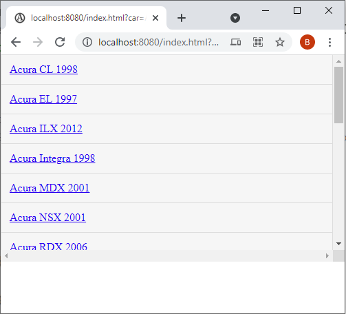

# Simple Rust Web Service

This is the readme file for a Medium article I published on creating a Simple Rust Web Service.

After cloning the code:

*git clone https://github.com/GroupTheorist12/SimpleRustWebService.git*

1. Change to the *SimpleRustWebService/cars_service* directory and do a *cargo run*. This will take some time to build the first time.

You should see the following output:

```bash
$ cargo run
    Finished dev [unoptimized + debuginfo] target(s) in 0.07s$ cargo run
    Finished dev [unoptimized + debuginfo] target(s) in 0.06s
     Running `target/debug/cars_service`
     
```

2. Open a new terminal session and change to the *SimpleRustWebService/cars_client* directory and do a cargo run. This will take some time to build the first time. 

You should see the following output:

```bash
   $ cargo run
       Finished dev [unoptimized + debuginfo] target(s) in 0.07s
        Running `target/debug/cars_client`
        
```

3.  Open a browser and go to http://127.0.0.1:8080/index.html. 

You should see the following in your browser: 


Change the url to http://localhost:8080/index.html?car=Acura&first_year=1999&query=make:eq,first_year:gt

This will produce the following output of just Acura cars.




